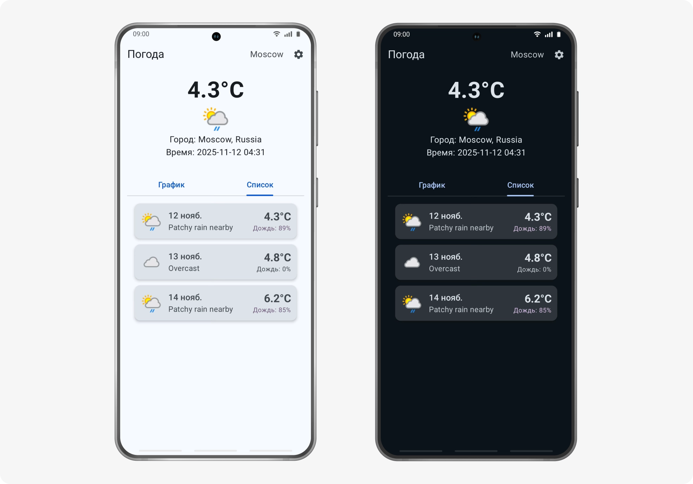

# WeatherForecastApp 🌤️ 🌦️ 🌨️ ❄️ ☀️

## Android-приложение для прогноза погоды

**WeatherForecastApp** — это пример Android-приложения для получения актуального прогноза погоды. Проект демонстрирует использование **Jetpack Compose**, **чистой архитектуры**, **многомодульности** и **безопасной работы с API-ключами** в CI/CD.

---

## Особенности

- Прогноз на **3 дня** с детализацией
- UI на **Jetpack Compose** + **Material 3**
- **Многомодульность** + **MVVM + Clean Architecture**
- **Koin**, **Retrofit**, **Coil**
- CI/CD с **GitHub Actions**

---

## Бэкенд

**WeatherAPI** — `https://api.weatherapi.com`  
Почасовой прогноз, иконки, осадки, ветер


---

## Архитектура приложения

- **Single Activity + Jetpack Navigation (Compose)**
- **Многомодульная структура**
- **Clean Architecture + MVVM**
    - `presentation` — UI (Compose), ViewModel
    - `domain` — use cases, модели
    - `data` — репозитории, API
- **Dependency Injection** — Koin
- **Асинхронность** — Kotlin Coroutines + StateFlow
- **Состояние UI** — через `ViewModel` + `MutableStateFlow`

---

## Технологии и инструменты

- **Kotlin**
- **Jetpack Compose** — декларативный UI
- **Coil** — загрузка иконок погоды с кэшированием
- **Material 3** — темы, анимации, адаптивность
- **Retrofit** — REST API
- **OkHttp** — логирование
- **Koin** - DI
- **Gradle Kotlin DSL**
- **Version Catalog** (`libs.versions.toml`)
- **ProGuard / R8**

---

## Безопасность API-ключей и CI/CD

### Локальная разработка
1. `local.properties`

   ```properties
   WEATHER_API_KEY=your_weatherapi_key
   ```

2. В `BuildConfig`:

   ```
   kotlinconst val WEATHER_API_KEY = BuildConfig.WEATHER_API_KEY
   ```

> `weather.properties` добавлен в `.gitignore`

---

## CI/CD

Собственный DevOps модуль

GitHub Actions

Воркфлоу: `build-and-test.yml`

Пример сборки приложения:

```yaml
# .github/workflows/build-and-test.yml
- name: Build Release APK
  run: ./gradlew assembleRelease
  env:
    WEATHER_API_KEY: ${{ secrets.WEATHER_API_KEY }}
  ```

---

### Скриншоты

<p align="left">

</p>


---
### Информация о проекте

> Данное приложение разработанно в образовательных целях
